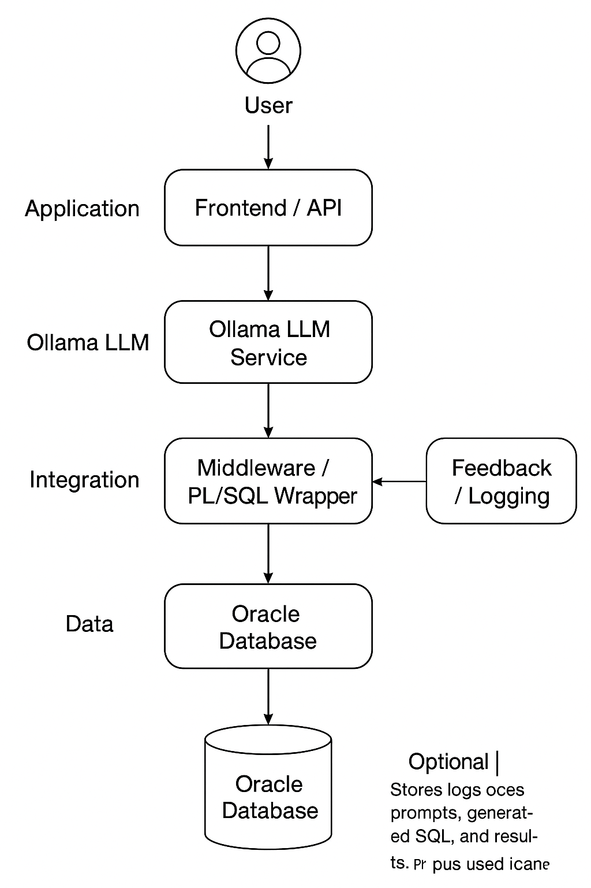

# Ollama ↔ Oracle Database Integration

This repository provides Oracle PL/SQL integration examples for invoking an Ollama LLM service from inside the database (using `APEX_WEB_SERVICE`), plus documentation and an architecture diagram.

**Included**
- `sql/fn_ollama_genai.sql` — production-ready PL/SQL function (based on user-provided code) that calls Ollama and returns a CLOB response.
- `examples/test_call.sql` — example anonymous block showing how to call the function.
- `images/architecture.png` — architecture diagram.
- `LICENSE` — MIT license.

> Architecture diagram (also in `images/architecture.png`):




---

## Overview

These functions let you send a prompt (optionally including a table schema from your database) to an Ollama instance and return the model's text response into Oracle as a CLOB. The example uses `APEX_WEB_SERVICE.make_rest_request` to POST JSON to the Ollama `/api/generate` endpoint.

**Design goals**
- Minimal, easy-to-deploy PL/SQL function.
- Optionally include database table schema to provide context to the model.
- Multiple response modes (human-readable, JSON, both).
- Clear error handling and useful example for testing.

---

## Prerequisites

1. Oracle Database (12c+ recommended) with `APEX_WEB_SERVICE` package available (APEX or APEX runtime).
2. Network access from the database host to the Ollama server (or proxy). If the DB server blocks outbound HTTP(S), configure Oracle Network ACLs.
3. Database user with privileges to create functions and use `DBMS_LOB`, `DBMS_OUTPUT`, and `APEX_WEB_SERVICE`.
4. (Optional) If you intend to log queries and responses, create a secure schema/table to store logs.

**Common issue:** `ORA-24247: network access denied by access control list (ACL)` — fix by creating and granting an ACL with `DBMS_NETWORK_ACL_ADMIN` or via Oracle DB security admin.

---

## Deployment

1. Place `images/architecture.png` at the repository root or in `images/`.
2. Run the SQL script to create the function:
```sql
@sql/pkg_ollama.sql
@sql/pkg_ollama.plb
```
3. Test with the example in `examples/test_call.sql`.

---

## Usage example

Call the function from a PL/SQL block:

```sql
-- Example 1: Generate SQL for a table
DECLARE
    l_sql CLOB;
BEGIN
    l_sql := pkg_ollama.generate_sql_from_ollama(
        p_table_name => 'EMPLOYEES',
        p_user_prompt => 'show me the top 5 highest paid employees'
    );
    DBMS_OUTPUT.PUT_LINE('Generated SQL: ' || l_sql);
END;
/

-- Example 2: Complete workflow with execution
DECLARE
    l_results CLOB;
    l_status  VARCHAR2(100);
    l_error   VARCHAR2(4000);
BEGIN
    pkg_ollama.execute_generated_sql(
        p_table_name => 'SALES',
        p_user_prompt => 'show monthly sales trends for 2024',
        p_results => l_results,
        p_status => l_status,
        p_error_msg => l_error
    );
    
    IF l_status = 'SUCCESS' THEN
        DBMS_OUTPUT.PUT_LINE('Results: ' || l_results);
    ELSE
        DBMS_OUTPUT.PUT_LINE('Error: ' || l_error);
    END IF;
END;
/

-- Example 3: Get AI insights
DECLARE
    l_insight CLOB;
BEGIN
    l_insight := pkg_ollama.get_ollama_insight(
        p_model => 'llama3.1:8b',
        p_question => 'What are the benefits of cloud data warehouses?'
    );
    DBMS_OUTPUT.PUT_LINE('Insight: ' || l_insight);
END;
/
```

---

## Files

### `sql/fn_ollama_genai.sql`
Creates `FN_OLLAMA_GENAI` — a complete function that:
- Optionally builds a table schema context from `USER_TAB_COLUMNS` when `p_table_name` is supplied.
- Constructs a JSON body and posts to the Ollama `/api/generate` endpoint.
- Extracts `$.response` from the returned JSON and strips Markdown code fences if present.

> See the SQL file for the full implementation.

### `examples/test_call.sql`
A small test script demonstrating how to call the function and print the first 4000 characters of response.

---

## Security & Hardening

- Do **not** hardcode secrets in PL/SQL. If Ollama requires authentication in your deployment, store tokens securely (Oracle Wallet, Vault, or protected table with restricted grants).
- Validate any user-supplied prompts if they are taken from external inputs.
- Limit which database schemas / tables can be described to the model (avoid leaking PII in prompts).
- Consider rate-limiting and input length checks to avoid costly or abusive usage.

---

## Troubleshooting

- `APEX_WEB_SERVICE` errors: ensure APEX is installed and configured. Some DBs require the `APEX_040200` (or version) schema components.
- `ORA-24247`: configure network ACLs:
```sql
BEGIN
  DBMS_NETWORK_ACL_ADMIN.create_acl(
    acl => 'web_services_acl.xml',
    description => 'Allow web service access',
    principal => 'YOUR_SCHEMA',
    is_grant => TRUE,
    privilege => 'connect'
  );
  DBMS_NETWORK_ACL_ADMIN.assign_acl(
    acl => 'web_services_acl.xml',
    host => 'oci.dropletssoftware.com'
  );
END;
/
COMMIT;
```

---

## License
MIT

---

## Contribution

Feel free to open issues or PRs with improvements (streaming support, better logging schema, OAuth auth, example APEX pages).
